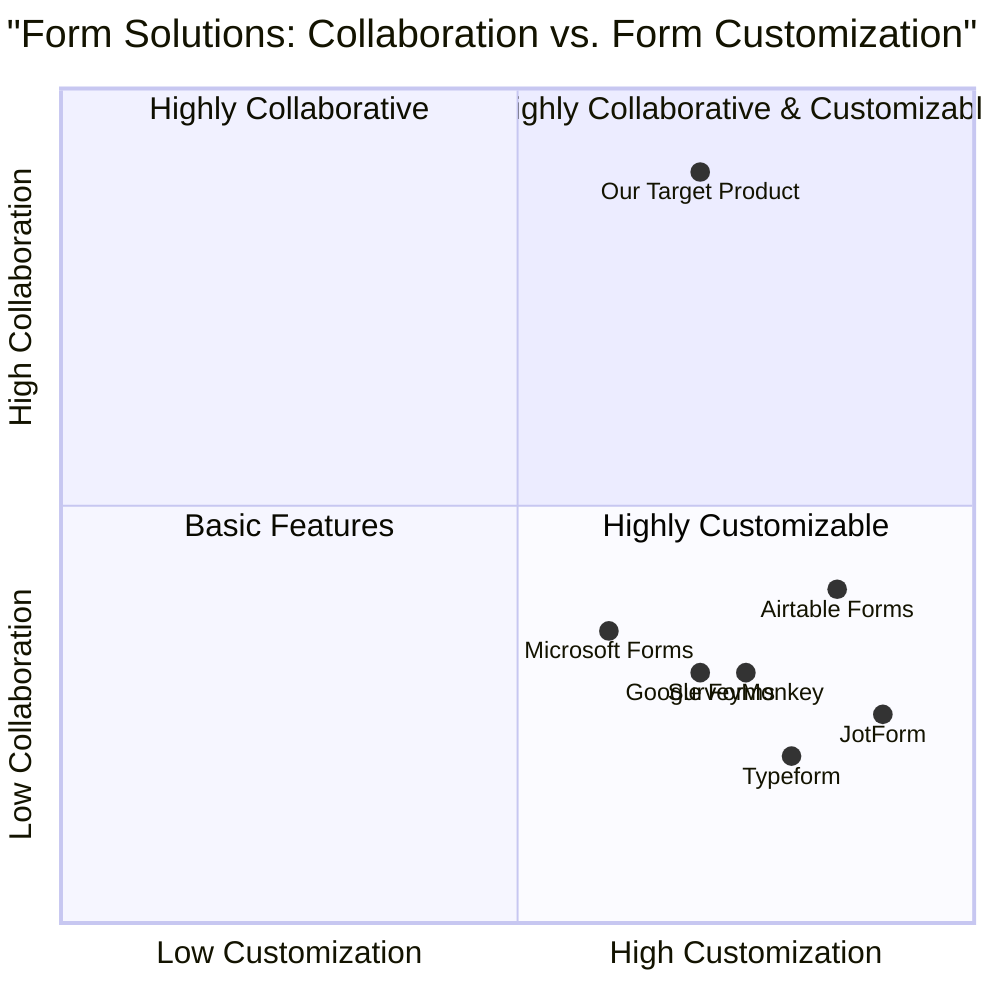
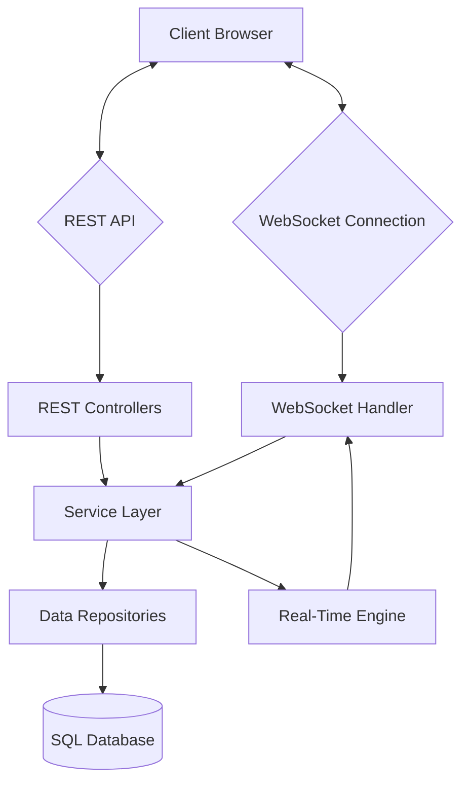
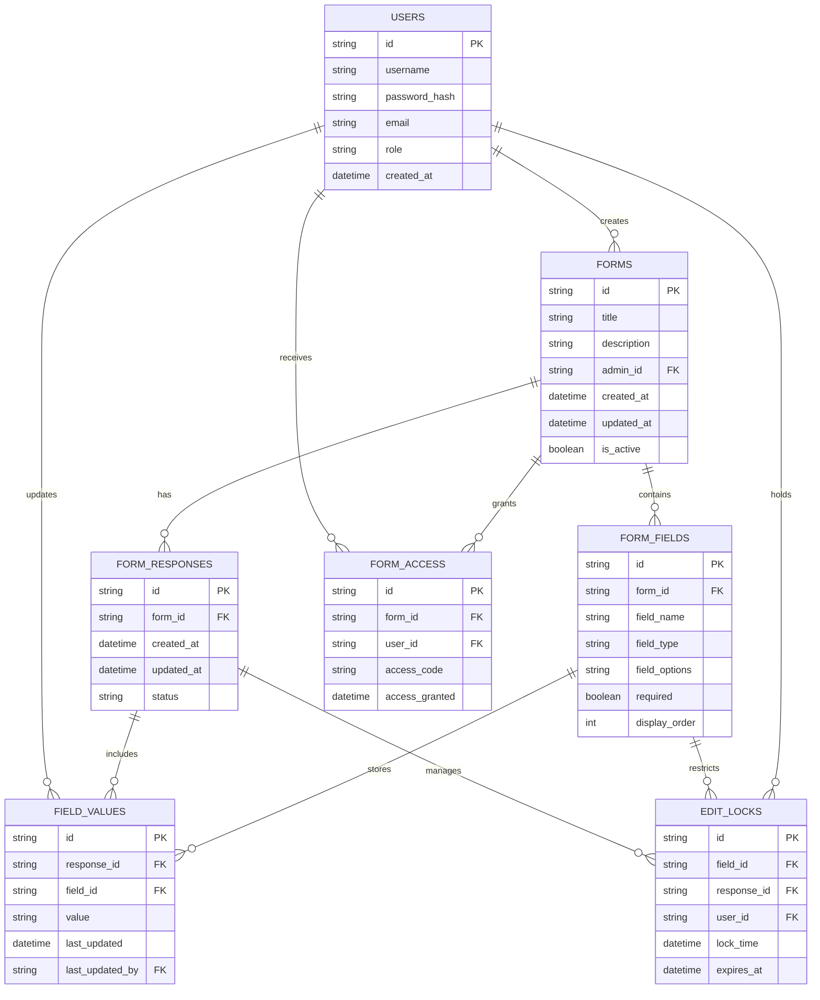

# Product Requirements Document: CollabForm

## Project Information

- **Project Name**: collab_form
- **Technology Stack**: Spring Boot (Java), WebSockets, SQL Database
- **Original Requirements**: Build a real-time collaborative form filling system similar to Google Docs but for structured forms, where multiple users can simultaneously edit a single shared form response.

## 1. Product Definition

### 1.1 Product Goals

1. Create a platform that enables real-time collaborative form filling with synchronized updates across all connected users
2. Provide administrators with a flexible form creation system with dynamic field types and sharing capabilities
3. Ensure data integrity and consistent user experience even during concurrent edits by multiple users

### 1.2 User Stories

1. As an admin, I want to create customizable forms with different field types so that I can collect specific types of information from users
2. As an admin, I want to share a unique link/code with users so that they can access and collaborate on filling specific forms
3. As a user, I want to see real-time changes made by other collaborators so that I can coordinate our form filling efforts
4. As a user, I want to know when another user is editing a specific field so that I can avoid edit conflicts
5. As an admin, I want to view and manage form submissions so that I can analyze the collected data

### 1.3 Competitive Analysis

| Product | Pros | Cons |
|---------|------|------|
| **Google Forms** | Easy to use, feature-rich form builder, Google account integration | Lacks real-time collaboration on a single response, primarily for collecting multiple responses |
| **Typeform** | Beautiful UI, dynamic form behavior, good user experience | No real-time collaboration, focused on individual responses |
| **JotForm** | Extensive form templates, powerful customization | Limited collaboration features, designed for individual submissions |
| **Microsoft Forms** | Good Microsoft ecosystem integration, simple interface | Limited real-time capabilities, basic collaboration options |
| **SurveyMonkey** | Robust analysis tools, extensive question types | Primarily for surveys, not collaborative form filling |
| **Airtable Forms** | Database integration, flexible data handling | Not focused on real-time collaboration |
| **CollabForm** (Our Target) | Real-time collaborative form filling, shared single response, conflict management | New platform, limited initial template options |

### 1.4 Competitive Quadrant Chart



## 2. Technical Specifications

### 2.1 Requirements Analysis

The CollabForm system requires a robust architecture to support real-time collaboration while ensuring data consistency. Key technical components include:

- **Backend**: Spring Boot application to handle business logic, authentication, and form management
- **Database**: SQL database for form definitions, user data, and form responses
- **Real-time Communication**: WebSocket implementation for live updates between users
- **User Authentication**: Role-based access control for admins and regular users
- **Conflict Resolution**: Mechanisms to handle simultaneous edits to the same field

The system must scale to handle multiple forms with concurrent users while maintaining responsiveness and data integrity.

### 2.2 Requirements Pool

#### P0 (Must-have)

1. Admin form creation with dynamic field types (text, number, dropdown, etc.)
2. Unique shareable link generation for each form
3. Real-time updates for all connected users when any field is modified
4. Basic conflict management (field locking or last-write-wins)
5. Role-based access control (admin vs. user)
6. Single shared response per form editable by multiple users
7. User authentication system
8. Form submissions storage and retrieval
9. WebSocket connection for real-time updates

#### P1 (Should-have)

1. Visual indicators showing which user is editing which field
2. Form templates for quick creation
3. Field validation rules configurable by admins
4. Session management for temporary disconnections
5. Basic analytics on form usage
6. Field edit history
7. User presence indicators showing who is currently viewing the form

#### P2 (Nice-to-have)

1. Rich text formatting in text fields
2. File upload fields
3. Commenting system on specific form fields
4. Form versioning
5. Advanced conflict resolution with merge capabilities
6. Offline mode with synchronization upon reconnection
7. Mobile-responsive design
8. Custom branding options for forms

### 2.3 System Architecture



### 2.4 Database Schema



### 2.5 UI Design Draft

#### Admin Dashboard
```
+-----------------------------------------------------------------------+
|  CollabForm                                         [User: Admin] ▼    |
+-----------------------------------------------------------------------+
| DASHBOARD  FORMS  TEMPLATES  SETTINGS                                  |
+-----------------------------------------------------------------------+
|                                                                       |
|  MY FORMS                                         [+ CREATE FORM]     |
|  +-----------------------------------------------------------------+ |
|  | Title            | Created      | Responses | Status    | Actions | |
|  |-----------------------------------------------------------------| |
|  | Project Proposal | 2023-06-10   | 1         | Active    | ···     | |
|  | Budget Request   | 2023-06-08   | 1         | Active    | ···     | |
|  | Team Feedback    | 2023-06-02   | 1         | Closed    | ···     | |
|  +-----------------------------------------------------------------+ |
|                                                                       |
|  RECENT ACTIVITY                                                      |
|  +-----------------------------------------------------------------+ |
|  | • Budget Request form was edited by user@example.com             | |
|  | • New user joined: team_member@company.com                       | |
|  | • Project Proposal form created                                  | |
|  +-----------------------------------------------------------------+ |
|                                                                       |
+-----------------------------------------------------------------------+
```

#### Form Builder
```
+-----------------------------------------------------------------------+
|  CollabForm > Form Builder                            [User: Admin] ▼   |
+-----------------------------------------------------------------------+
| FORM DETAILS  FIELDS  SHARING  PREVIEW                                  |
+-----------------------------------------------------------------------+
|                                                                       |
|  FORM TITLE: Project Proposal                                         |
|  DESCRIPTION: Collaborative project proposal submission form          |
|                                                                       |
|  FORM FIELDS:                        [+ ADD FIELD]                    |
|  +-----------------------------------------------------------------+ |
|  | ↕ Project Title     | Text      | Required ✓ | Edit | Delete     | |
|  | ↕ Department        | Dropdown  | Required ✓ | Edit | Delete     | |
|  | ↕ Budget Estimate   | Number    | Required ✓ | Edit | Delete     | |
|  | ↕ Project Goals     | Text Area | Required ✓ | Edit | Delete     | |
|  | ↕ Timeline         | Date Range| Required ✓ | Edit | Delete     | |
|  +-----------------------------------------------------------------+ |
|                                                                       |
|  [SAVE DRAFT]                                          [PUBLISH]     |
|                                                                       |
+-----------------------------------------------------------------------+
```

#### Collaborative Form View
```
+-----------------------------------------------------------------------+
|  CollabForm > Project Proposal                    [3 users online] ▼    |
+-----------------------------------------------------------------------+
|                                                                       |
|  PROJECT PROPOSAL                                                     |
|  Collaborative project proposal submission form                       |
|                                                                       |
|  +-----------------------------------------------------------------+ |
|  | Project Title*                                                    | |
|  | [Marketing Automation Platform Upgrade________________________]   | |
|  | Currently editing: John D.                                        | |
|  +-----------------------------------------------------------------+ |
|  | Department*                                                      | |
|  | [Marketing_________________________________________________] ▼    | |
|  +-----------------------------------------------------------------+ |
|  | Budget Estimate* ($)                                             | |
|  | [75000____]                                                       | |
|  | Currently editing: Sarah M.                                       | |
|  +-----------------------------------------------------------------+ |
|  | Project Goals*                                                    | |
|  | [The goal of this project is to upgrade our current marketing    | |
|  |  automation platform to improve lead generation capabilities     | |
|  |  and integrate with our new CRM system...]                       | |
|  +-----------------------------------------------------------------+ |
|  | Timeline*                                                        | |
|  | [07/15/2023] to [10/30/2023]                                     | |
|  +-----------------------------------------------------------------+ |
|                                                                       |
|  USERS ONLINE: John D., Sarah M., Miguel R.                          |
|                                                                       |
|  [SAVE]                                              [SUBMIT FORM]   |
|                                                                       |
+-----------------------------------------------------------------------+
```

## 3. Open Questions

1. Should we implement a notification system to alert users when a form they have access to has been modified?
2. How long should edit locks be maintained before timing out if a user becomes inactive?
3. Should we implement form versioning to track major changes to the form structure after it has been shared?
4. What level of granularity should we use for conflict resolution - field level, form level, or character level for text fields?
5. Should we allow admins to set user-specific permissions within a shared form (e.g., some users can only edit specific sections)?

## 4. Implementation Plan

### 4.1 Phase 1: Core Functionality

- User authentication and role management
- Basic form creation with essential field types
- Form sharing mechanism
- Simple real-time updates using WebSockets
- Basic conflict management (field locking)

### 4.2 Phase 2: Enhanced Collaboration

- Visual indicators for user presence and field editing
- Improved conflict resolution
- Form templates
- Field validation rules
- Edit history tracking

### 4.3 Phase 3: Advanced Features

- Rich text formatting
- File uploads
- Comments and annotations
- Analytics dashboard
- Mobile responsiveness improvements

## 5. Technical Implementation Details

### 5.1 Spring Boot Implementation

The backend will be implemented using Spring Boot with the following key components:

- **Spring WebSocket**: For real-time communication between clients and server
- **Spring Security**: For authentication and authorization
- **Spring Data JPA**: For database operations
- **Spring REST Controllers**: For HTTP API endpoints

### 5.2 Real-time Synchronization

```java
@Configuration
@EnableWebSocketMessageBroker
public class WebSocketConfig implements WebSocketMessageBrokerConfigurer {

    @Override
    public void configureMessageBroker(MessageBrokerRegistry config) {
        config.enableSimpleBroker("/topic");
        config.setApplicationDestinationPrefixes("/app");
    }

    @Override
    public void registerStompEndpoints(StompEndpointRegistry registry) {
        registry.addEndpoint("/collab-form-websocket")
                .withSockJS();
    }
}
```

### 5.3 Conflict Resolution Strategy

The system will implement a field-locking mechanism to prevent concurrent edits of the same field:

1. When a user starts editing a field, a lock is acquired for that field
2. Other users are notified that the field is being edited and by whom
3. The lock is released when:
   - The user completes the edit and submits the change
   - The user navigates away from the field
   - The user's session becomes inactive for a defined period (timeout)

For text fields, we will implement a last-write-wins strategy with visual indicators showing another user is currently editing.

## 6. Success Metrics

### 6.1 Technical Metrics

- System response time under 200ms for form loading
- WebSocket message delivery latency under 100ms
- Support for at least 20 concurrent users per form without performance degradation
- 99.9% uptime for the service

### 6.2 User Experience Metrics

- Reduction in form completion time compared to traditional sequential workflows
- User satisfaction ratings for the collaborative experience
- Reduction in form submission errors compared to traditional forms

## 7. Timeline

- **Weeks 1-2**: System architecture, database design, and basic backend setup
- **Weeks 3-4**: Core form CRUD operations and user management
- **Weeks 5-6**: WebSocket implementation and real-time collaboration features
- **Weeks 7-8**: Conflict resolution, field locking, and testing
- **Weeks 9-10**: UI refinement, bug fixes, and performance optimization
- **Week 11-12**: Final testing, documentation, and deployment preparation