# System Design: CollabForm - Real-time Collaborative Form Filling System

## Implementation approach

Based on the requirements in the PRD, CollabForm needs to support real-time collaborative form filling with synchronized updates across multiple users. The key requirements include form creation by admins, dynamic field types, real-time updates, field locking for conflict management, and role-based access control.

The difficult aspects of these requirements include:

1. **Real-time synchronization**: Ensuring all connected users see updates immediately with minimal latency
2. **Concurrent edit handling**: Managing conflicts when multiple users try to edit the same field
3. **Data consistency**: Maintaining consistency across all clients during simultaneous edits
4. **Scalability**: Supporting multiple forms with concurrent users

### Technology Choices

1. **Spring Boot**: Core framework for building the RESTful API and business logic
2. **Spring WebSocket**: For real-time communication between clients and server
3. **Spring Security**: For authentication and role-based access control
4. **Spring Data JPA**: For database operations and entity management
5. **MySQL/PostgreSQL**: Relational database for structured data storage
6. **Redis**: For session management, caching, and managing field locks
7. **JWT**: For secure authentication tokens
8. **STOMP over WebSocket**: For real-time message exchange

## Data structures and interfaces

The system will be organized into the following key components and their relationships:

```mermaid
classDiagram
    class User {
        -Long id
        -String username
        -String email
        -String passwordHash
        -UserRole role
        -LocalDateTime createdAt
        +Long getId()
        +String getUsername()
        +String getEmail()
        +UserRole getRole()
        +boolean isAdmin()
    }

    class Form {
        -Long id
        -String title
        -String description
        -User admin
        -LocalDateTime createdAt
        -LocalDateTime updatedAt
        -boolean active
        -List~FormField~ fields
        -FormResponse response
        +Long getId()
        +String getTitle()
        +String getDescription()
        +User getAdmin()
        +List~FormField~ getFields()
        +FormResponse getResponse()
        +String generateShareCode()
        +void addField(FormField field)
        +void removeField(Long fieldId)
        +void updateField(FormField field)
    }

    class FormField {
        -Long id
        -Form form
        -String fieldName
        -FieldType fieldType
        -String fieldOptions
        -boolean required
        -int displayOrder
        +Long getId()
        +String getFieldName()
        +FieldType getFieldType()
        +String getFieldOptions()
        +boolean isRequired()
        +int getDisplayOrder()
        +void setFieldName(String fieldName)
        +void setFieldType(FieldType fieldType)
        +void setFieldOptions(String options)
    }

    class FormResponse {
        -Long id
        -Form form
        -LocalDateTime createdAt
        -LocalDateTime updatedAt
        -ResponseStatus status
        -List~FieldValue~ fieldValues
        +Long getId()
        +Form getForm()
        +LocalDateTime getUpdatedAt()
        +List~FieldValue~ getFieldValues()
        +void updateFieldValue(Long fieldId, String value, User user)
    }

    class FieldValue {
        -Long id
        -FormResponse response
        -FormField field
        -String value
        -LocalDateTime lastUpdated
        -User lastUpdatedBy
        +Long getId()
        +FormField getField()
        +String getValue()
        +void setValue(String value, User user)
        +User getLastUpdatedBy()
        +LocalDateTime getLastUpdated()
    }

    class FormAccess {
        -Long id
        -Form form
        -User user
        -String accessCode
        -LocalDateTime accessGranted
        +Long getId()
        +Form getForm()
        +User getUser()
        +String getAccessCode()
    }

    class EditLock {
        -Long id
        -FormField field
        -FormResponse response
        -User user
        -LocalDateTime lockTime
        -LocalDateTime expiresAt
        +Long getId()
        +FormField getField()
        +User getUser()
        +boolean isExpired()
        +void refresh()
        +void release()
    }

    class UserRole {
        <<enumeration>>
        ADMIN
        USER
    }

    class FieldType {
        <<enumeration>>
        TEXT
        NUMBER
        TEXTAREA
        DROPDOWN
        RADIO
        CHECKBOX
        DATE
        TIME
        DATETIME
    }

    class ResponseStatus {
        <<enumeration>>
        DRAFT
        SUBMITTED
        ARCHIVED
    }
    
    class UserController {
        +ResponseEntity register(UserRegisterDto dto)
        +ResponseEntity login(LoginDto dto)
        +ResponseEntity getCurrentUser()
    }

    class FormController {
        -FormService formService
        +ResponseEntity createForm(FormCreateDto dto)
        +ResponseEntity updateForm(Long id, FormUpdateDto dto)
        +ResponseEntity getForm(Long id)
        +ResponseEntity listForms()
        +ResponseEntity deleteForm(Long id)
        +ResponseEntity shareForm(Long id, ShareFormDto dto)
    }

    class FormFieldController {
        -FormFieldService fieldService
        +ResponseEntity addField(Long formId, FieldCreateDto dto)
        +ResponseEntity updateField(Long fieldId, FieldUpdateDto dto)
        +ResponseEntity deleteField(Long fieldId)
        +ResponseEntity getFields(Long formId)
    }

    class FormResponseController {
        -FormResponseService responseService
        +ResponseEntity getFormResponse(Long formId)
        +ResponseEntity updateFieldValue(Long formId, Long fieldId, UpdateFieldValueDto dto)
        +ResponseEntity submitFormResponse(Long formId)
    }

    class FormCollaborationController {
        -FormCollaborationService collaborationService
        +ResponseEntity joinForm(String accessCode)
        +ResponseEntity getCurrentCollaborators(Long formId)
        +ResponseEntity acquireLock(Long formId, Long fieldId)
        +ResponseEntity releaseLock(Long formId, Long fieldId)
    }

    class WebSocketController {
        -FormCollaborationService collaborationService
        +FormUpdateMessage updateField(UpdateFieldMessage message)
        +void handleUserJoined(UserJoinMessage message)
        +void handleUserLeft(UserLeftMessage message)
        +LockAcquiredMessage acquireLock(LockRequestMessage message)
    }

    class FormService {
        -FormRepository formRepository
        -FormFieldRepository fieldRepository
        -FormAccessRepository accessRepository
        +Form createForm(FormCreateDto dto, User admin)
        +Form updateForm(Long id, FormUpdateDto dto)
        +Form getForm(Long id)
        +List~Form~ listFormsByUser(User user)
        +void deleteForm(Long id)
        +String generateShareCode(Long formId)
    }

    class FormFieldService {
        -FormFieldRepository fieldRepository
        -FormRepository formRepository
        +FormField addField(Long formId, FieldCreateDto dto)
        +FormField updateField(Long fieldId, FieldUpdateDto dto)
        +void deleteField(Long fieldId)
        +List~FormField~ getFields(Long formId)
    }

    class FormResponseService {
        -FormResponseRepository responseRepository
        -FieldValueRepository valueRepository
        -EditLockRepository lockRepository
        +FormResponse getOrCreateResponse(Long formId)
        +FieldValue updateFieldValue(Long formId, Long fieldId, String value, User user)
        +FormResponse submitResponse(Long formId)
        +List~FieldValue~ getFieldValues(Long responseId)
    }

    class FormCollaborationService {
        -FormAccessRepository accessRepository
        -EditLockRepository lockRepository
        -FormService formService
        -SimpMessagingTemplate messagingTemplate
        +Form joinForm(String accessCode, User user)
        +List~User~ getCurrentCollaborators(Long formId)
        +EditLock acquireLock(Long formId, Long fieldId, User user)
        +void releaseLock(Long formId, Long fieldId, User user)
        +void notifyFieldUpdate(Long formId, Long fieldId, String value, User updatedBy)
        +void notifyUserJoined(Long formId, User user)
        +void notifyUserLeft(Long formId, User user)
    }

    class UserRepository {
        +Optional~User~ findByUsername(String username)
        +Optional~User~ findByEmail(String email)
    }

    class FormRepository {
        +List~Form~ findByAdmin(User admin)
    }

    class FormFieldRepository {
        +List~FormField~ findByFormId(Long formId)
        +void deleteByFormId(Long formId)
    }

    class FormResponseRepository {
        +Optional~FormResponse~ findByFormId(Long formId)
    }

    class FieldValueRepository {
        +Optional~FieldValue~ findByResponseIdAndFieldId(Long responseId, Long fieldId)
        +List~FieldValue~ findByResponseId(Long responseId)
    }

    class FormAccessRepository {
        +Optional~FormAccess~ findByAccessCode(String accessCode)
        +List~FormAccess~ findByFormId(Long formId)
    }

    class EditLockRepository {
        +Optional~EditLock~ findByFieldIdAndResponseId(Long fieldId, Long responseId)
        +List~EditLock~ findByResponseId(Long responseId)
        +void deleteByUserIdAndResponseId(Long userId, Long responseId)
    }

    class WebSocketConfig {
        +void configureMessageBroker(MessageBrokerRegistry config)
        +void registerStompEndpoints(StompEndpointRegistry registry)
    }

    class SecurityConfig {
        +SecurityFilterChain filterChain(HttpSecurity http)
        +PasswordEncoder passwordEncoder()
        +JwtAuthenticationFilter jwtAuthFilter()
    }

    User "1" --o "*" Form : creates
    User "1" --o "*" FormAccess : has
    User "1" --o "*" EditLock : holds
    User "1" --o "*" FieldValue : updates

    Form "1" --* "*" FormField : contains
    Form "1" --o "1" FormResponse : has
    Form "1" --o "*" FormAccess : grants

    FormField "1" --o "*" FieldValue : defines
    FormField "1" --o "*" EditLock : locks

    FormResponse "1" --* "*" FieldValue : contains
    FormResponse "1" --o "*" EditLock : manages

    FormController -- FormService : uses
    FormFieldController -- FormFieldService : uses
    FormResponseController -- FormResponseService : uses
    FormCollaborationController -- FormCollaborationService : uses
    WebSocketController -- FormCollaborationService : uses

    FormService -- FormRepository : uses
    FormFieldService -- FormFieldRepository : uses
    FormResponseService -- FormResponseRepository : uses
    FormResponseService -- FieldValueRepository : uses
    FormResponseService -- EditLockRepository : uses
    FormCollaborationService -- FormAccessRepository : uses
    FormCollaborationService -- EditLockRepository : uses
```



## API Endpoints

### User Management

```
POST /api/v1/auth/register - Register a new user
POST /api/v1/auth/login - Login and get JWT token
GET /api/v1/auth/me - Get current user information
```

### Form Management

```
POST /api/v1/forms - Create a new form
GET /api/v1/forms - List all forms for current user
GET /api/v1/forms/{formId} - Get specific form details
PUT /api/v1/forms/{formId} - Update form details
DELETE /api/v1/forms/{formId} - Delete a form
POST /api/v1/forms/{formId}/share - Generate sharing info for a form
```

### Form Fields

```
POST /api/v1/forms/{formId}/fields - Add a new field to a form
GET /api/v1/forms/{formId}/fields - Get all fields for a form
PUT /api/v1/forms/{formId}/fields/{fieldId} - Update a specific field
DELETE /api/v1/forms/{formId}/fields/{fieldId} - Delete a field
```

### Form Responses

```
GET /api/v1/forms/{formId}/response - Get the collaborative form response
PUT /api/v1/forms/{formId}/response/fields/{fieldId} - Update a field value
POST /api/v1/forms/{formId}/response/submit - Submit the form response
```

### Collaboration

```
POST /api/v1/collaborate/join - Join a form using access code
GET /api/v1/collaborate/{formId}/users - Get current collaborators
POST /api/v1/collaborate/{formId}/fields/{fieldId}/lock - Acquire an edit lock
DELETE /api/v1/collaborate/{formId}/fields/{fieldId}/lock - Release an edit lock
```

## WebSocket API

The WebSocket communication will use STOMP protocol and the following endpoints:

```
Endpoint: /collab-form-websocket
Application Prefix: /app
Subscription Prefix: /topic
```

### WebSocket Subscription Topics

```
/topic/forms/{formId}/field-updates - Field value updates
/topic/forms/{formId}/users - User presence updates
/topic/forms/{formId}/locks - Field lock status updates
```

### WebSocket Message Types

1. **Field Update Message**
   ```json
   {
     "type": "FIELD_UPDATE",
     "fieldId": 123,
     "value": "New field value",
     "updatedBy": {
       "id": 456,
       "username": "john_doe"
     },
     "timestamp": "2023-06-11T15:30:45.123Z"
   }
   ```

2. **User Join Message**
   ```json
   {
     "type": "USER_JOIN",
     "user": {
       "id": 456,
       "username": "john_doe"
     },
     "timestamp": "2023-06-11T15:30:00.123Z"
   }
   ```

3. **User Leave Message**
   ```json
   {
     "type": "USER_LEAVE",
     "user": {
       "id": 456,
       "username": "john_doe"
     },
     "timestamp": "2023-06-11T15:45:10.123Z"
   }
   ```

4. **Lock Acquired Message**
   ```json
   {
     "type": "LOCK_ACQUIRED",
     "fieldId": 123,
     "user": {
       "id": 456,
       "username": "john_doe"
     },
     "expiresAt": "2023-06-11T15:35:45.123Z"
   }
   ```

5. **Lock Released Message**
   ```json
   {
     "type": "LOCK_RELEASED",
     "fieldId": 123
   }
   ```

## Handling Concurrent Edits

### Field Locking Strategy

The system implements a field-level locking mechanism to prevent concurrent edits:

1. **Lock Acquisition**:
   - When a user focuses on a form field, the client sends a lock request to the server
   - If the field is not locked, the server grants the lock to the user
   - If the field is already locked by another user, the server rejects the lock request
   - Locks are granted with a 30-second expiration, refreshed as the user continues editing

2. **Lock Management**:
   - Locks are stored in Redis with TTL (time-to-live) for automatic expiration
   - The system maintains a mapping of userIds to their currently held locks
   - When a user acquires a lock, all other connected clients are notified via WebSocket
   - Clients display visual indicators showing which fields are being edited and by whom

3. **Lock Release**:
   - Locks are automatically released when:
     - The user submits the field value change
     - The user explicitly blurs/exits the field
     - The user's session becomes inactive (30-second timeout)
     - The user disconnects from the WebSocket
   - When a lock is released, connected clients are notified

### Conflict Resolution

Even with locking mechanisms, conflicts may still occur due to network latency or race conditions:

1. **Optimistic Locking**:
   - Each field update includes a version number
   - The server validates that the update is based on the latest version
   - If a version conflict is detected, the update is rejected, and the client is notified

2. **Last-Write-Wins Strategy**:
   - For simpler fields or in case of conflicts, the last-write-wins strategy is used
   - All clients are synchronized with the latest version from the server

3. **Operational Transform for Text Fields**:
   - For longer text fields, an operational transform approach can be implemented
   - This allows for merging concurrent edits more intelligently

## WebSocket Implementation

The WebSocket configuration in Spring Boot will be set up as follows:

```java
@Configuration
@EnableWebSocketMessageBroker
public class WebSocketConfig implements WebSocketMessageBrokerConfigurer {

    @Override
    public void configureMessageBroker(MessageBrokerRegistry config) {
        config.enableSimpleBroker("/topic");
        config.setApplicationDestinationPrefixes("/app");
    }

    @Override
    public void registerStompEndpoints(StompEndpointRegistry registry) {
        registry.addEndpoint("/collab-form-websocket")
                .setAllowedOrigins("*") // Configure appropriately for production
                .withSockJS();
    }
}
```

Main WebSocket controller for handling real-time events:

```java
@Controller
public class WebSocketController {

    private final FormCollaborationService collaborationService;
    private final SimpMessagingTemplate messagingTemplate;

    public WebSocketController(FormCollaborationService collaborationService, 
                             SimpMessagingTemplate messagingTemplate) {
        this.collaborationService = collaborationService;
        this.messagingTemplate = messagingTemplate;
    }

    @MessageMapping("/forms/{formId}/update-field")
    public void updateField(@DestinationVariable Long formId,
                          @Payload UpdateFieldMessage message,
                          Principal principal) {
        User user = ((UserPrincipal) principal).getUser();
        FieldValue updatedValue = collaborationService.updateFieldValue(
            formId, message.getFieldId(), message.getValue(), user);
            
        // Broadcast the update to all subscribers
        FieldUpdateMessage updateMsg = new FieldUpdateMessage(
            message.getFieldId(), 
            updatedValue.getValue(), 
            UserDto.fromUser(user), 
            updatedValue.getLastUpdated()
        );
        
        messagingTemplate.convertAndSend(
            "/topic/forms/" + formId + "/field-updates", 
            updateMsg
        );
    }

    @MessageMapping("/forms/{formId}/acquire-lock")
    public void acquireLock(@DestinationVariable Long formId,
                          @Payload LockRequestMessage message,
                          Principal principal) {
        User user = ((UserPrincipal) principal).getUser();
        EditLock lock = collaborationService.acquireLock(formId, message.getFieldId(), user);
        
        if (lock != null) {
            LockAcquiredMessage lockMsg = new LockAcquiredMessage(
                message.getFieldId(),
                UserDto.fromUser(user),
                lock.getExpiresAt()
            );
            
            messagingTemplate.convertAndSend(
                "/topic/forms/" + formId + "/locks", 
                lockMsg
            );
        }
    }

    @MessageMapping("/forms/{formId}/release-lock")
    public void releaseLock(@DestinationVariable Long formId,
                          @Payload LockReleaseMessage message,
                          Principal principal) {
        User user = ((UserPrincipal) principal).getUser();
        collaborationService.releaseLock(formId, message.getFieldId(), user);
        
        LockReleasedMessage releaseMsg = new LockReleasedMessage(message.getFieldId());
        messagingTemplate.convertAndSend(
            "/topic/forms/" + formId + "/locks", 
            releaseMsg
        );
    }

    @EventListener
    public void handleSessionConnected(SessionConnectedEvent event) {
        StompHeaderAccessor accessor = StompHeaderAccessor.wrap(event.getMessage());
        // Handle user connected event
    }

    @EventListener
    public void handleSessionDisconnect(SessionDisconnectEvent event) {
        StompHeaderAccessor accessor = StompHeaderAccessor.wrap(event.getMessage());
        Principal principal = accessor.getUser();
        if (principal != null) {
            User user = ((UserPrincipal) principal).getUser();
            // Clean up user locks and notify other users
            collaborationService.handleUserDisconnect(user);
        }
    }
}
```

## Security Implementation

The system will implement JWT-based authentication with Spring Security:

```java
@Configuration
@EnableWebSecurity
public class SecurityConfig {

    private final JwtAuthenticationFilter jwtAuthFilter;
    private final UserDetailsService userDetailsService;

    public SecurityConfig(JwtAuthenticationFilter jwtAuthFilter, UserDetailsService userDetailsService) {
        this.jwtAuthFilter = jwtAuthFilter;
        this.userDetailsService = userDetailsService;
    }

    @Bean
    public SecurityFilterChain filterChain(HttpSecurity http) throws Exception {
        return http
            .csrf(csrf -> csrf.disable())
            .authorizeHttpRequests(auth -> {
                auth.requestMatchers("/api/v1/auth/**").permitAll();
                auth.requestMatchers("/collab-form-websocket/**").authenticated();
                auth.requestMatchers("/api/v1/**").authenticated();
                auth.anyRequest().authenticated();
            })
            .sessionManagement(session -> session.sessionCreationPolicy(SessionCreationPolicy.STATELESS))
            .authenticationProvider(authenticationProvider())
            .addFilterBefore(jwtAuthFilter, UsernamePasswordAuthenticationFilter.class)
            .build();
    }

    @Bean
    public AuthenticationProvider authenticationProvider() {
        DaoAuthenticationProvider provider = new DaoAuthenticationProvider();
        provider.setUserDetailsService(userDetailsService);
        provider.setPasswordEncoder(passwordEncoder());
        return provider;
    }

    @Bean
    public PasswordEncoder passwordEncoder() {
        return new BCryptPasswordEncoder();
    }
}
```

## Scaling Considerations

1. **Database Scaling**:
   - Use database connection pooling
   - Implement caching for frequently accessed forms and fields
   - Consider database sharding for large-scale deployments

2. **WebSocket Scaling**:
   - Use a message broker like RabbitMQ or Kafka for distributing WebSocket messages in a clustered environment
   - Implement sticky sessions for WebSocket connections

3. **Application Scaling**:
   - Make the application stateless to allow horizontal scaling
   - Use Redis or a similar distributed cache for session storage and field locks
   - Consider containerization with Docker and orchestration with Kubernetes

## Monitoring and Observability

1. **Performance Monitoring**:
   - Implement Micrometer metrics for Spring Boot application monitoring
   - Track WebSocket connection counts and message throughput
   - Monitor database query performance

2. **Logging**:
   - Use structured logging with SLF4J and Logback
   - Include correlation IDs for tracking requests across services

3. **Error Handling**:
   - Implement global exception handling for REST endpoints
   - Add appropriate error handling for WebSocket communication

## Deployment Strategy

1. **CI/CD Pipeline**:
   - Set up a pipeline for automated testing and deployment
   - Use environment-specific configuration for dev, staging, and production

2. **Containerization**:
   - Use Docker for containerizing the application
   - Docker Compose for local development
   - Kubernetes for production deployment

## Anything UNCLEAR

1. **User Authentication Extensions**: The current design uses a simple JWT-based authentication system. Depending on requirements, integration with OAuth providers (Google, Microsoft) might be beneficial.

2. **Form Template Management**: The current design doesn't include detailed specification for form templates. This could be added as an extension.

3. **Analytics Requirements**: The system could benefit from more detailed analytics on form usage and collaboration patterns, which could be implemented as a separate module.

4. **Long-term Storage Strategy**: For forms with many responses or large-scale usage, a more detailed data retention and archiving strategy would be needed.

5. **Mobile Support Requirements**: The current design focuses on web-based access. Specific adaptations might be needed for optimal mobile experience.